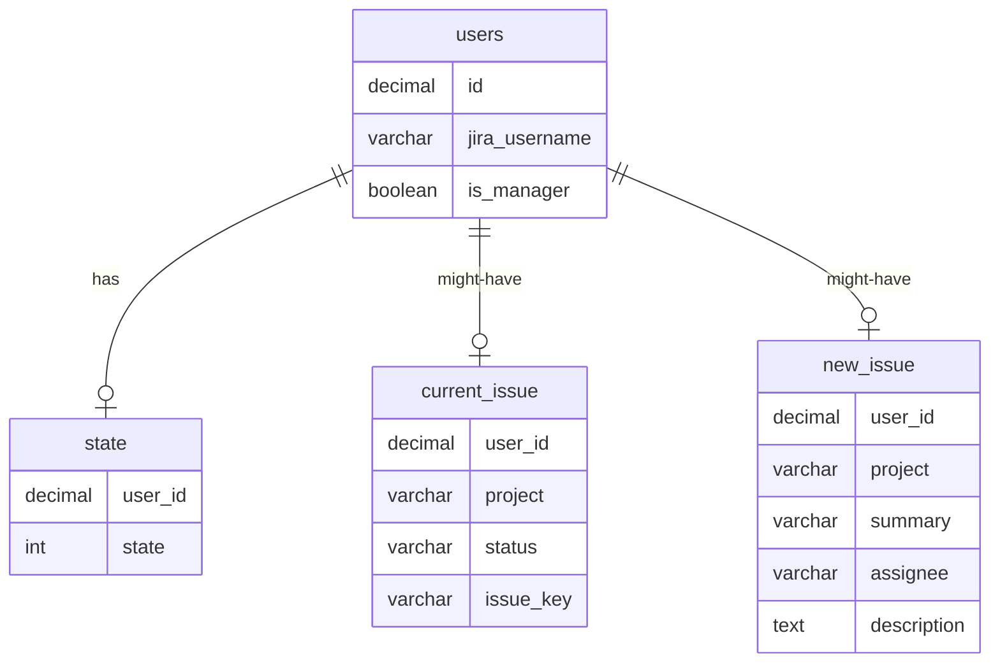

# Telegram-бот для управления задачами Jira

## Конфигурация `project/config.py`

```python
# project/config.py

LOG_FILE = 'LOG_FILE'

TG_TOKEN = 'TG_TOKEN'

# Jira config (jira user should have administrator rights)
JIRA_USERNAME = 'JIRA_USERNAME'
JIRA_PASSWORD = 'JIRA_PASSWORD'
JIRA_URL = 'JIRA_URL'

# Database connectivity config
DBC = {
    'username': 'USERNAME',
    'password': 'PASSWORD',
    'host': 'HOST',
    'port': PORT,
    'database': 'DATABASE',
}
```

## Структура БД



## Требуемые пакеты

1. jira
2. psycopg2
3. requests
4. telebot (pyTelegramBotAPI)
